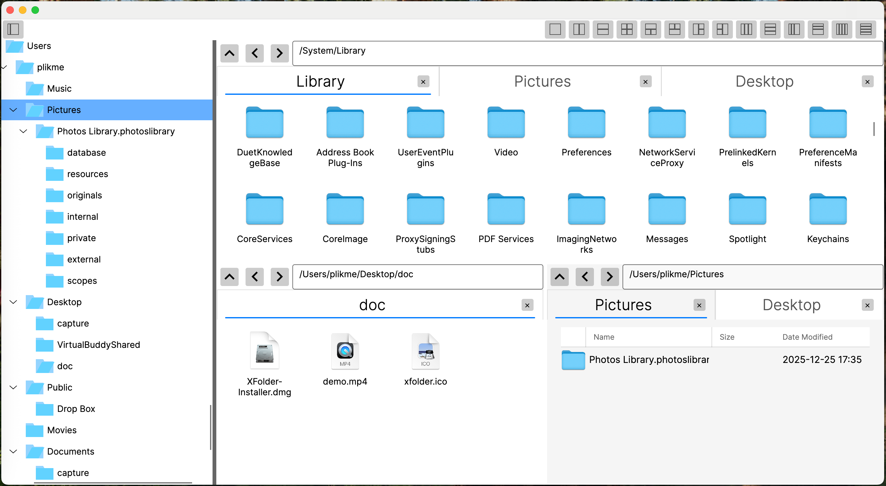

    

# XFolder

XFolder is a modern file manager designed specifically for macOS. It integrates core features such as multi-pane views, a smart directory tree, and multi-tab management, aiming to provide a more efficient and flexible file browsing experience than Finder.

This project is built based on C# (Avalonia UI) and Swift.

## 📸 Preview

    

## 📥 Download & Installation

The source code for this software is currently not open source. You can download the latest macOS installer package directly from the GitHub Releases page.

[👉 Go to Downloads (GitHub Releases)](https://github.com/plikme/XFolder/releases)
*(Please update this link according to the actual release URL)*

### Installation Steps
1. Download the latest `XFolder-Installer.dmg` file.
2. Double-click to open the `.dmg` file.
3. Drag the `XFolder` icon into the `Applications` folder.
4. Launch `XFolder` from the Launchpad or Applications folder.

> **Note**: As the app is not signed by an Apple Developer (verify if applicable), you may see a "can't be opened" or "unknown developer" warning upon first launch. Please go to **System Settings** > **Privacy & Security** and click "Open Anyway".

## ✨ Features

*   **Tabs Management**
*   **Multiple Pane Layouts**
*   **Directory Tree View**

## ⌨️ Shortcuts

XFolder supports rich keyboard shortcuts to enhance productivity:

### User Interface / Navigation
| Action | Shortcut |
| :--- | :--- |
| **Next Pane** | `⌃` + `⇧` + `→` |
| **Previous Pane** | `⌃` + `⇧` + `←` |
| **Details View** | `⌃` + `0` or `⌃` + `Num 0` |
| **Grid View** | `⌃` + `1` or `⌃` + `Num 1` |
| **Open in Finder** | `⌘` + `E` |
| **Open Terminal** | `⌃` + `~` |

### File Operations
| Action | Shortcut |
| :--- | :--- |
| **Copy** | `⌘` + `C` |
| **Cut** | `⌘` + `X` |
| **Paste** | `⌘` + `V` |
| **Delete** | `Delete` or `⌘` + `D` |
| **Delete Permanently** | `⇧` + `Delete` |
| **Rename** | `F2` |
| **Open** | `Enter` |
| **New Folder** | `⌘` + `⇧` + `N` |

### Tabs & Editing
| Action | Shortcut |
| :--- | :--- |
| **Close Tab** | `⌘` + `W` |
| **Duplicate Tab** | `⌘` + `⇧` + `K` |
| **Undo** | `⌘` + `Z` |
| **Redo** | `⌘` + `Y` |

*(Check the Help menu in the app for more shortcuts)*

## 💬 Feedback & Support

If you encounter any bugs or have suggestions for new features, please feel free to report them in GitHub Issues.

*   [Report a Bug](https://github.com/plikme/XFolder/issues)
*   [Feature Request](https://github.com/plikme/XFolder/issues)

## 🙏 Acknowledgements

Special thanks to the following projects for their support:

*   **[AvaloniaUI](https://github.com/AvaloniaUI/Avalonia)**: A powerful cross-platform .NET UI framework.
*   **[Files](https://github.com/files-community/Files)**: An excellent Windows file manager; this project references parts of its architectural design and code.
*   **[Q-Dir](https://www.q-dir.com)**: A classic multi-pane file explorer that provided significant design inspiration.

## 📄 License

XFolder is Proprietary Software (c).
All rights reserved. Unauthorized decompilation, modification, repackaging, or commercial distribution is prohibited.
